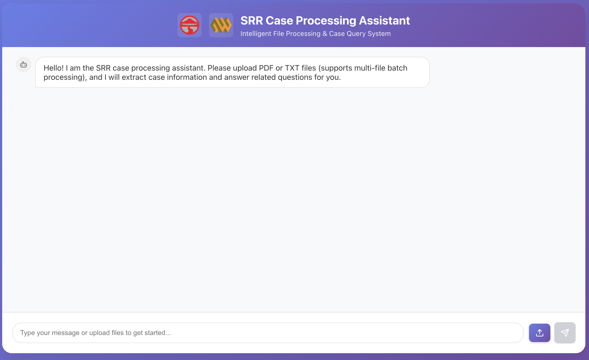

# 🏗️ SRR Case Processing System

[](https://choosealicense.com/licenses/mit/)
[](https://www.python.org/downloads/)
[](https://nodejs.org/)
[](https://fastapi.tiangolo.com/)
[](https://reactjs.org/)

An AI-powered document processing system that automatically extracts and classifies case data from Slope Risk Reports (SRR) in multiple file formats.

## 🎯 Overview

Transform unstructured documents (TXT, TMO PDFs, RCC PDFs) into standardized case records with AI-powered classification and data extraction.

## ⚡ Quick Start

```bash
# 1. Install dependencies
pip install -r config/requirements.txt

# 2. Set up environment variables (required)
export OPENAI_API_KEY="your-openai-api-key"
# Optional: If using proxy for OpenAI
export OPENAI_PROXY_URL="socks5://localhost:7890"
export OPENAI_USE_PROXY="true"

# 3. Start the system
python start.py start

# 4. Access the web interface
# Frontend: http://localhost:3000
# Backend API: http://localhost:8001
```

## 🚀 Key Features

- **Multi-format Processing**: TXT files, TMO PDFs, RCC PDFs
- **AI Classification**: 92% accuracy case type, 98% subject matter
- **Historical Case Matching**: Search 5,298 historical cases for patterns
- **OCR Processing**: Advanced text recognition for scanned documents
- **Batch Processing**: Handle multiple files simultaneously
- **Integrated Chat Interface**: Popup-based file management
- **Tree Information Tracking**: 32,405 trees with location data
- **Location-Slope Learning**: 403 auto-learned mappings

## 🖥️ Web Interface Display

### 📸 Interface Screenshot

#### 🏠 Main Interface


#### 📈 Interactive Display


## 📁 Project Structure

```
project3/
├── 🚀 start.py                    # System startup script
├── 📋 README.md                   # This file
├── 📚 FEATURES.md                 # Feature reference guide
├── 📖 HOW_TO_USE.md               # User guide
├── backend/                      # React web interface
│   ├── src/                           # Source code
│   │   ├── api/                      # FastAPI backend
│   │   ├── core/                     # Document processors (TXT/TMO/RCC)
│   │   ├── ai/                       # AI/ML classifiers
│   │   ├── services/                 # Business logic services
│   │   │   ├── historical_case_matcher.py  # Similarity matching
│   │   │   └── llm_service.py              # OpenAI API
│   │   ├── database/                 # Database management
│   │   └── utils/                    # Utility functions
│   ├── data/                          # Historical data (5,298 cases + 32,405 trees)
│   ├── config/                        # Configuration files
│   ├── docs/                          # Technical documentation (9 guides)
│   └── models/                        # AI models and rules
└── frontend/srr-chatbot/         # React web interface

```

## 📊 Processing Pipeline

```
File Upload → Classification → Content Extraction → AI Processing → Database + Similarity Search
     ↓              ↓               ↓                ↓                    ↓
Multi-format    TXT/TMO/RCC    Text/OCR/PDF      Case Type         A-Q Columns
  Support       Detection      Extraction      Classification       JSON Data
                                                                   + Similar Cases
                                                                   (from 5,298 historical)
```

## 🔧 System Requirements

- **Python 3.8+** with ML libraries
- **Node.js 16+** for frontend
- **4GB+ RAM** for AI models and historical data caching
- **10GB storage** for dependencies and data files
- **OpenAI API Key**
- **Proxy** (optional, for regions where OpenAI is blocked)

## 📚 Documentation

### Core Documentation
| Document | Description |
|----------|-------------|
| [📖 HOW_TO_USE.md](HOW_TO_USE.md) | **Complete user guide** |
| [⚡ FEATURES.md](FEATURES.md) | **Feature overview and quick reference** |
| [📋 WORKFLOW_DESIGN.md](WORKFLOW_DESIGN.md) | System workflow and architecture |
| [🏗️ PROJECT_STRUCTURE.md](PROJECT_STRUCTURE.md) | Code organization and structure |

### Technical Documentation (docs/)
| Document | Description |
|----------|-------------|
| [🔌 API_DOCUMENTATION.md](docs/API_DOCUMENTATION.md) | API endpoints reference |
| [🔍 CASE_SIMILARITY_SEARCH.md](docs/CASE_SIMILARITY_SEARCH.md) | Similarity matching algorithms |
| [🗄️ DATABASE_GUIDE.md](docs/DATABASE_GUIDE.md) | Database operations |
| [🚀 DEPLOYMENT_GUIDE.md](docs/DEPLOYMENT_GUIDE.md) | Production deployment |
| [💻 DEVELOPMENT_GUIDE.md](docs/DEVELOPMENT_GUIDE.md) | Development setup |
| [🤖 AI_FEATURES.md](docs/AI_FEATURES.md) | AI model details |
| [🔑 OPENAI_API_SETUP.md](docs/OPENAI_API_SETUP.md) | LLM and proxy configuration |

## 🎯 Performance Metrics

- **TXT Files**: < 5 seconds processing
- **TMO PDFs**: < 60 seconds with AI
- **RCC PDFs**: < 120 seconds including OCR
- **Similar Case Search**: < 2 seconds (across 5,298 cases)
- **AI Classification Accuracy**: 92-98%
- **Field Completion**: 95%+

## 🛠️ Development

```bash
# Run system checks
python start.py check

# Clean up existing processes
python start.py cleanup

# Start individual components
cd src/api && python main.py          # Backend only
cd frontend/srr-chatbot && npm start  # Frontend only

# View help
python start.py help
```

## 🔧 Advanced Usage

### Smart Process Management
The startup script automatically detects and cleans up existing processes:

```bash
# System will auto-detect and clean existing processes before starting
python start.py

# Manual cleanup if needed
python start.py cleanup

# Check system status without starting
python start.py check
```

## 📞 Support

For questions or issues:
1. Check the [WORKFLOW_DESIGN.md](WORKFLOW_DESIGN.md) for complete system documentation
2. Review the [Documentation Index](docs/DOCUMENTATION_INDEX.md) for detailed guides
3. Open an [Issue](https://github.com/[USERNAME]/SRR-Case-Processing-System/issues) for bug reports or feature requests

## 📄 License

This project is licensed under the MIT License - see the [LICENSE](LICENSE) file for details.

## 🏆 Acknowledgments

- Built with FastAPI and React
- AI models powered by Transformers and scikit-learn
- OCR capabilities using EasyOCR and Tesseract
- Document processing with PyMuPDF and pdfplumber

# Contributors
Thank you to all contributors who have devoted their efforts to this project. This document records the specific contributions of each participant.

Special thanks to Professor Li for her guidance.

Iteration 0: Version v0.0.0
| Username | GitHub ID | Responsible Modules | Specific Contributions |
| -------- | --------- | ------------------- | ---------------------- |
| Zhang Weijian | February13 | core | **Project Initialization**: Created initial commit for SRR Case Processing System (foundational project architecture)  |


Iteration 1: Version v1.0.0 (2026-02-01)
| Username | GitHub ID | Commits | Lines Added | Lines Deleted | Main Contributions |
|-------------|-------------|---------|-------------|---------------|-------------------|
| Zhang Weijian | **February13** | 55 | 59,234 | 17,612 | **Core Feature Development**: Smart pair function, historical case matching, AI functionality<br>**ICC Module**: Date Received, Interim Due, Final Due field logic processing<br>**Cloud Deployment**: Docker compose config, Cloud Run, Firebase deployment<br>**RCC/TMO Module**: Prompt optimization, source classification logic refactoring<br>**Frontend Fixes**: Upload, avatar, icons, etc.<br>**Documentation & Maintenance**: Code comments, project documentation, database module |
| Hou Haochen | **HHC-1998** | 3 | 140 | 25 | **RCC Prompt Optimization**: Modified prompts for columns J and R<br>**New RCC Prompt**: Added new prompt configurations for RCC |
| Luo Kairong | **jsildf** | 5 | 204 | 157 | **Prompt Regex Optimization**: Extract slopno via regex after prompt before returning<br>**TMO and ICC Rules**: Added new rules for TMO and ICC processing<br>**Branch Merge Operations**: Merged branches<br>**TMO and ICC Rules**: Added TMO and ICC rules (collaborated with lkr) |


---

**Last Updated**: 2026-02-08  
**Version**: 2.0

