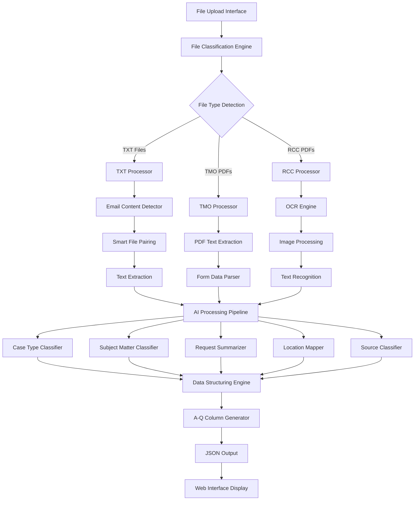

# SRR Case Processing System - Workflow Design

## 🎯 System Overview

The SRR (Slope Risk Report) Case Processing System is an AI-powered document processing pipeline that extracts, classifies, and structures data from multiple file formats into standardized case records.

## 🏗️ System Architecture



## 📋 Processing Workflow

### Phase 1: File Ingestion and Classification

#### 1.1 File Upload
- **Input**: Multiple file formats (TXT, PDF)
- **Process**: Drag-and-drop interface with batch upload support
- **Output**: File metadata and temporary storage

#### 1.2 File Type Detection
```python
Algorithm: File Extension + Content Analysis
- Check file extension (.txt, .pdf)
- For PDFs: Analyze filename patterns (ASD-*, RCC#*)
- Content-based validation
```

#### 1.3 Smart File Pairing
- **Purpose**: Group related files (TXT + email content)
- **Algorithm**: Pattern matching on filenames
- **Example**: `3-3YXXSJV.txt` + `emailcontent_3-3YXXSJV.txt`

### Phase 2: Content Extraction

#### 2.1 TXT File Processing
```python
Process Flow:
1. Encoding Detection (chardet library)
2. Text Content Extraction
3. Email Content Integration
4. Contact Information Extraction
```

#### 2.2 TMO PDF Processing
```python
Process Flow:
1. PDF Text Extraction (pdfplumber, PyPDF2)
2. Form Field Identification
3. Date and Reference Parsing
4. Officer Information Extraction
```

#### 2.3 RCC PDF Processing
```python
Process Flow:
1. Image Detection and Rotation Correction
2. OCR Processing (EasyOCR)
3. Text Recognition and Cleanup
4. Structured Data Extraction
```

### Phase 3: AI-Powered Data Processing

#### 3.1 Case Type Classification
- **Model**: RandomForestClassifier + Rule-based System
- **Categories**: Emergency, Urgent, General
- **Features**: Content keywords, urgency indicators, historical patterns

#### 3.2 Subject Matter Classification
- **Model**: TfidfVectorizer + RandomForestClassifier
- **Categories**: 17 predefined types (Cracked slope, Drainage Blockage, etc.)
- **Training Data**: Historical cases from Excel files

#### 3.3 Request Summarization
- **Approach**: Doubao API (Volcengine) + Pattern Recognition
- **Input**: Email content or PDF text
- **Output**: Concise one-sentence summary (max 200 characters)

#### 3.4 Location Mapping
- **Data Source**: Slope data Excel file (1903 records)
- **Algorithm**: Multi-level matching (Direct → Extracted → Smart → Fuzzy)
- **Output**: Venue name from slope number

#### 3.5 Source Classification
- **Method**: Rule-based + Semantic Analysis
- **Categories**: ICC, Telephone, E-mail, RCC, TMO, etc.
- **Logic**: File type + content analysis + email presence

### Phase 4: Data Structuring

#### 4.1 A-Q Column Generation
```python
Standard Output Format:
A: Date Received (dd-MMM-yyyy)
B: Source (12 predefined options)
C: Case Number (format varies by type)
D: Type (Emergency/Urgent/General)
E: Caller Name
F: Contact Number
G: Slope Number
H: Location
I: Nature of Request (AI summary)
J: Subject Matter (17 categories)
K: 10-day Rule Due Date (A + 10 days)
L: ICC Interim Due (A + 10 calendar days)
M: ICC Final Due (A + 21 calendar days)
N-Q: Additional fields
```

#### 4.2 Data Validation
- **Date Format Standardization**: All dates to dd-MMM-yyyy
- **Field Completeness Check**: Required fields validation
- **Data Type Verification**: Ensure correct data types

## 🤖 AI Model Architecture

### Model Pipeline
```python
1. Data Preprocessing
   ├── Text Cleaning
   ├── Feature Extraction
   └── Encoding Detection

2. Classification Models
   ├── Case Type Classifier (Accuracy: 92%)
   ├── Subject Matter Classifier (Accuracy: 98%)
   └── Source Classifier (Rule-based)

3. NLP Processing
   ├── Request Summarization
   ├── Contact Information Extraction
   └── Location Mapping

4. Model Caching
   ├── In-memory Model Storage
   ├── 30-minute Cache Timeout
   └── Performance Optimization
```

### Training Data Sources
- **Historical Cases**: 8,284 records from Excel files
- **SRR Rules**: Domain-specific classification rules
- **Slope Data**: 1,903 location mappings

## 🔄 Performance Optimization

### Processing Time Targets
- **TXT Files**: < 5 seconds
- **TMO PDFs**: < 60 seconds
- **RCC PDFs**: < 120 seconds

### Optimization Strategies
1. **Model Caching**: Avoid redundant model loading
2. **Fast OCR**: Reduced resolution for speed
3. **Parallel Processing**: Concurrent file handling
4. **Smart Fallbacks**: Graceful degradation

## 📊 Quality Assurance

### Accuracy Metrics
- **Case Type Classification**: 92% accuracy
- **Subject Matter Classification**: 98% accuracy
- **OCR Text Recognition**: Variable (depends on image quality)

### Error Handling
- **Graceful Degradation**: System continues with partial data
- **Detailed Logging**: Comprehensive error tracking
- **Fallback Mechanisms**: Alternative processing paths

## 🚀 Deployment Architecture

### Backend Components
```python
FastAPI Application
├── API Endpoints (/api/process-files)
├── File Upload Handler
├── Processing Pipeline
├── AI Model Services
└── Response Formatter
```

### Frontend Components
```typescript
React Application
├── Chatbot Interface
├── File Upload Component
├── Progress Tracking
├── Results Display
└── Error Handling
```

### Infrastructure Requirements
- **Python 3.8+** with ML libraries
- **Node.js 16+** for frontend
- **Memory**: 4GB+ for AI models
- **Storage**: Temporary file processing space

## 🔧 Configuration Management

### Environment Variables
```python
API_HOST = "localhost"
API_PORT = 8001  # Updated port
FRONTEND_PORT = 3000
MODEL_CACHE_TIMEOUT = 1800  # 30 minutes
OCR_TIMEOUT = 120  # 2 minutes
ARK_API_KEY = "doubao_api_key"  # Volcengine API key
```

### Data Dependencies
- **models/mapping_rules/slope_location_mapping.json**: Cached location mappings
- **models/ai_models/training_data.pkl**: Cached training data
- **models/config/srr_rules.json**: Cached classification rules

## 📈 Monitoring and Analytics

### Key Performance Indicators
- **Processing Success Rate**: % of successfully processed files
- **Average Processing Time**: By file type
- **Classification Accuracy**: AI model performance
- **User Satisfaction**: Interface usability metrics

### Logging Strategy
- **Request Logging**: All API calls and responses
- **Error Tracking**: Detailed error information
- **Performance Metrics**: Processing time and resource usage
- **AI Model Performance**: Classification confidence scores

## 🔮 Future Enhancements

### Planned Features
1. **Advanced OCR**: Better handling of complex layouts
2. **Multi-language Support**: Chinese text processing
3. **Real-time Processing**: WebSocket-based updates
4. **Advanced Analytics**: Trend analysis and reporting
5. **API Integration**: External system connectivity

### Scalability Considerations
- **Microservices Architecture**: Separate processing services
- **Container Deployment**: Docker-based deployment
- **Load Balancing**: Handle multiple concurrent requests
- **Database Integration**: Persistent data storage

## 📋 Maintenance Guidelines

### Regular Tasks
- **Model Retraining**: Update with new historical data
- **Performance Monitoring**: Track processing times
- **Data Backup**: Secure historical data storage
- **Security Updates**: Keep dependencies current

### Troubleshooting
- **OCR Issues**: Check image quality and rotation
- **Classification Errors**: Review training data
- **Performance Problems**: Monitor resource usage
- **API Errors**: Check logs and error handling

---

This workflow design provides a comprehensive overview of the SRR Case Processing System, covering all aspects from file ingestion to final output generation. The system is designed for reliability, accuracy, and scalability while maintaining high performance standards.
