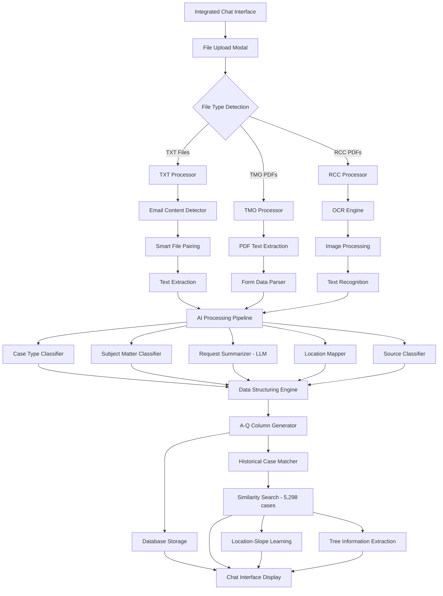

# SRR Case Processing System - Workflow Design

## 🎯 System Overview

The SRR (Slope Risk Report) Case Processing System is an AI-powered document processing pipeline that extracts, classifies, and structures data from multiple file formats into standardized case records.

## 🏗️ System Architecture



## 📋 Processing Workflow

### Phase 1: File Ingestion and Classification

#### 1.1 File Upload
- **Input**: Multiple file formats (TXT, PDF)
- **Process**: Integrated chat interface with popup modal for file management
- **Features**: Drag-and-drop support, batch upload, file preview
- **Output**: File metadata and temporary storage

#### 1.2 File Type Detection
```python
Algorithm: File Extension + Content Analysis
- Check file extension (.txt, .pdf)
- For PDFs: Analyze filename patterns (ASD-*, RCC#*)
- Content-based validation
```

#### 1.3 Smart File Pairing
- **Purpose**: Group related files (TXT + email content)
- **Algorithm**: Pattern matching on filenames
- **Example**: `3-3YXXSJV.txt` + `emailcontent_3-3YXXSJV.txt`

### Phase 2: Content Extraction

#### 2.1 TXT File Processing
```python
Process Flow:
1. Encoding Detection (chardet library)
2. Text Content Extraction
3. Email Content Integration
4. Contact Information Extraction
```

#### 2.2 TMO PDF Processing
```python
Process Flow:
1. PDF Text Extraction (pdfplumber, PyPDF2)
2. Form Field Identification
3. Date and Reference Parsing
4. Officer Information Extraction
```

#### 2.3 RCC PDF Processing
```python
Process Flow:
1. Image Detection and Rotation Correction
2. OCR Processing (EasyOCR)
3. Text Recognition and Cleanup
4. Structured Data Extraction
```

### Phase 3: AI-Powered Data Processing

#### 3.1 Case Type Classification
- **Model**: RandomForestClassifier + Rule-based System
- **Categories**: Emergency, Urgent, General
- **Features**: Content keywords, urgency indicators, historical patterns

#### 3.2 Subject Matter Classification
- **Model**: TfidfVectorizer + RandomForestClassifier
- **Categories**: 17 predefined types (Cracked slope, Drainage Blockage, etc.)
- **Training Data**: Historical cases from Excel files

#### 3.3 Request Summarization
- **Primary**: OpenAI API (gpt-4o-mini) with proxy support
- **Alternative**: Volcengine Doubao API
- **Fallback**: Pattern-based extraction (17 regex patterns)
- **Input**: Email content or PDF text
- **Output**: Concise one-sentence summary (max 200 characters)

#### 3.4 Location Mapping
- **Data Source**: Slope data Excel file (1903 records)
- **Algorithm**: Multi-level matching (Direct → Extracted → Smart → Fuzzy)
- **Output**: Venue name from slope number

#### 3.5 Source Classification
- **Method**: Rule-based + Semantic Analysis
- **Categories**: ICC, Telephone, E-mail, RCC, TMO, etc.
- **Logic**: File type + content analysis + email presence

### Phase 4: Historical Case Matching

#### 4.1 Similarity Search
- **Data Sources**: 
  - Slopes Complaints 2021 (4,047 cases)
  - SRR Data 2021-2024 (1,251 cases)
  - Tree Inventory (32,405 trees)
- **Algorithm**: Weighted multi-criteria matching
- **Weights**:
  - Location: 40%
  - Slope/Tree Number: 30%
  - Subject Matter: 15%
  - Caller Name: 10%
  - Phone Number: 5%

#### 4.2 Duplicate Detection
- **Threshold**: ≥ 70% similarity score
- **Purpose**: Identify recurring issues and potential duplicates
- **Output**: List of similar cases with match scores

#### 4.3 Location-Slope Learning
- **Auto-Learning**: 403 location-slope mappings
- **Purpose**: Handle address variations
- **Method**: Extract from historical complaint records

#### 4.4 Tree Information Extraction
- **Source**: Remarks column (AZ) from Excel
- **Extracted Data**: Tree ID, count, inspector remarks
- **Integration**: Link to tree inventory database

### Phase 5: Data Structuring

#### 5.1 A-Q Column Generation
```python
Standard Output Format:
A: Date Received (dd-MMM-yyyy)
B: Source (12 predefined options)
C: Case Number (format varies by type)
D: Type (Emergency/Urgent/General)
E: Caller Name
F: Contact Number
G: Slope Number
H: Location
I: Nature of Request (AI summary)
J: Subject Matter (17 categories)
K: 10-day Rule Due Date (A + 10 days)
L: ICC Interim Due (A + 10 calendar days)
M: ICC Final Due (A + 21 calendar days)
N-Q: Additional fields
```

#### 5.2 Data Validation
- **Date Format Standardization**: All dates to dd-MMM-yyyy
- **Field Completeness Check**: Required fields validation
- **Data Type Verification**: Ensure correct data types

#### 5.3 Database Storage
- **Storage**: SQLite database (srr_cases.db)
- **Purpose**: Current case management and query
- **Note**: Excluded from similarity search to avoid self-matching

## 🤖 AI Model Architecture

### Model Pipeline
```python
1. Data Preprocessing
   ├── Text Cleaning
   ├── Feature Extraction
   └── Encoding Detection

2. Classification Models
   ├── Case Type Classifier (Accuracy: 92%)
   ├── Subject Matter Classifier (Accuracy: 98%)
   └── Source Classifier (Rule-based)

3. NLP Processing
   ├── Request Summarization
   ├── Contact Information Extraction
   └── Location Mapping

4. Model Caching
   ├── In-memory Model Storage
   ├── 30-minute Cache Timeout
   └── Performance Optimization
```

### Training Data Sources
- **Historical Cases**: 5,298 searchable records (Excel/CSV)
  - Slopes Complaints 2021: 4,047 cases
  - SRR Data 2021-2024: 1,251 cases
- **Tree Inventory**: 32,405 trees with location data
- **SRR Rules**: Domain-specific classification rules
- **Location Mappings**: 403 auto-learned from historical data
- **Database**: Current cases (excluded from similarity search)

## 🔄 Performance Optimization

### Processing Time Targets
- **TXT Files**: < 5 seconds
- **TMO PDFs**: < 60 seconds
- **RCC PDFs**: < 120 seconds
- **Similarity Search**: < 2 seconds (5,298 cases)
- **Historical Data Loading**: 2-3 seconds (startup)

### Optimization Strategies
1. **Model Caching**: Avoid redundant model loading
2. **Historical Data Caching**: Load once at startup, keep in memory
3. **Fast OCR**: Reduced resolution for speed
4. **Parallel Processing**: Concurrent file handling
5. **Smart Fallbacks**: Graceful degradation
6. **Database Exclusion**: Avoid unnecessary similarity searches on current cases

## 📊 Quality Assurance

### Accuracy Metrics
- **Case Type Classification**: 92% accuracy
- **Subject Matter Classification**: 98% accuracy
- **OCR Text Recognition**: Variable (depends on image quality)
- **Similarity Matching**: High precision with weighted scoring
- **Location-Slope Mapping**: 403 verified associations

### Error Handling
- **Graceful Degradation**: System continues with partial data
- **Detailed Logging**: Comprehensive error tracking
- **Fallback Mechanisms**: Alternative processing paths

## 🚀 Deployment Architecture

### Backend Components
```python
FastAPI Application
├── API Endpoints (/api/process-files)
├── File Upload Handler
├── Processing Pipeline
├── AI Model Services
└── Response Formatter
```

### Frontend Components
```typescript
React Application
├── Integrated Chat Interface
├── File Upload Modal
├── File Info Modal
├── Progress Tracking
├── Results Display
├── Popup Management
└── Error Handling
```

### Infrastructure Requirements
- **Python 3.8+** with ML libraries
- **Node.js 16+** for frontend
- **Memory**: 4GB+ for AI models
- **Storage**: Temporary file processing space

## 🔧 Configuration Management

### Environment Variables
```python
# Required
OPENAI_API_KEY = "sk-..."          # OpenAI API key (primary)
ARK_API_KEY = "..."                # Volcengine API key (alternative)

# Optional
API_HOST = "localhost"
API_PORT = 8001
FRONTEND_PORT = 3000
LLM_PROVIDER = "openai"            # openai or volcengine
OPENAI_PROXY_URL = "socks5://localhost:7890"  # Proxy URL
OPENAI_USE_PROXY = "true"          # Enable proxy
MODEL_CACHE_TIMEOUT = 1800         # 30 minutes
OCR_TIMEOUT = 120                  # 2 minutes
```

### Data Dependencies
- **data/Slopes Complaints...xlsx**: Historical complaints (4,047 cases)
- **data/SRR data 2021-2024.csv**: Historical SRR data (1,251 cases)
- **data/Tree inventory.xlsx**: Tree database (32,405 trees)
- **data/srr_cases.db**: SQLite database (current cases)
- **models/mapping_rules/slope_location_mapping.json**: Cached location mappings
- **models/ai_models/training_data.pkl**: Cached training data
- **models/config/srr_rules.json**: Cached classification rules

## 📈 Monitoring and Analytics

### Key Performance Indicators
- **Processing Success Rate**: % of successfully processed files
- **Average Processing Time**: By file type
- **Classification Accuracy**: AI model performance
- **User Satisfaction**: Interface usability metrics

### Logging Strategy
- **Request Logging**: All API calls and responses
- **Error Tracking**: Detailed error information
- **Performance Metrics**: Processing time and resource usage
- **AI Model Performance**: Classification confidence scores

## 🔮 Future Enhancements

### Planned Features
1. **Advanced OCR**: Better handling of complex layouts
2. **Multi-language Support**: Enhanced Chinese text processing
3. **Real-time Processing**: WebSocket-based updates
4. **Advanced Analytics**: Temporal trend analysis and pattern detection
5. **Geographic Visualization**: Map-based complaint clustering
6. **Predictive Analytics**: Forecast future complaints based on historical patterns
7. **API Integration**: External system connectivity

### Scalability Considerations
- **Microservices Architecture**: Separate processing services
- **Container Deployment**: Docker-based deployment
- **Load Balancing**: Handle multiple concurrent requests
- **Database Integration**: Persistent data storage

## 📋 Maintenance Guidelines

### Regular Tasks
- **Model Retraining**: Update with new historical data
- **Performance Monitoring**: Track processing times
- **Data Backup**: Secure historical data storage
- **Security Updates**: Keep dependencies current

### Troubleshooting
- **OCR Issues**: Check image quality and rotation
- **Classification Errors**: Review training data
- **Performance Problems**: Monitor resource usage
- **API Errors**: Check logs and error handling

---

**Last Updated**: 2025-10-19  
**Version**: 2.0

This workflow design provides a comprehensive overview of the SRR Case Processing System, covering all aspects from file ingestion to final output generation. The system is designed for reliability, accuracy, and scalability while maintaining high performance standards.
